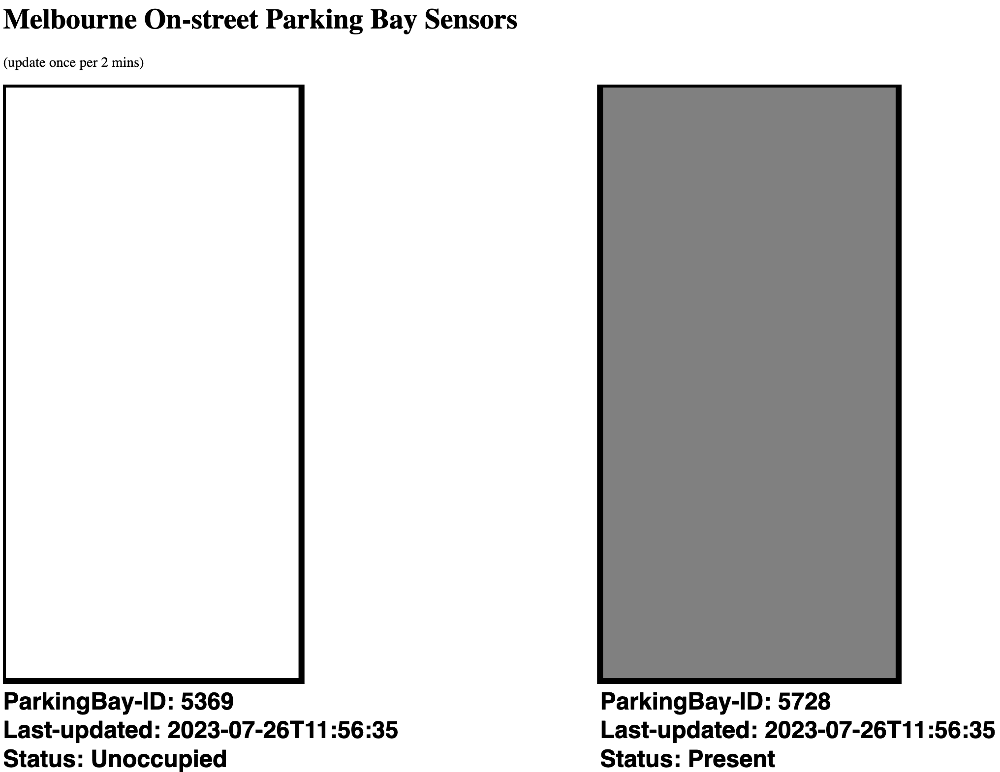

# Melbourne On-street Parking Bay Sensors

Progress:
* Schedule updateAllData() function every two mins
* On Bay 1: Extract (from hard-coded data) bay ID, last updated, and status description, then show in text
* Use data from console command output
* Extend this method to Bay 2
* Change bay color according to status description

TODO / TOFIX:
* ...

